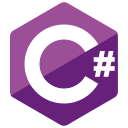
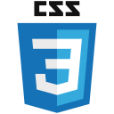
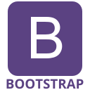
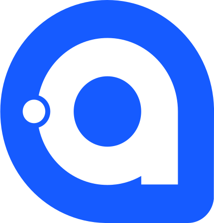

#  Hi there! I'm Edoardo 👋

I am an Italian software engineer with over 20 years of experience in creating digital products and a strong understanding of the software development lifecycle.

I specialize in designing and building scalable, user-centered solutions, guiding companies from concept to implementation.

Thanks to my technical skills and ability to work both independently and as part of a team, I have contributed to the development or maintenance of numerous projects in sectors such as SCADA, WMS, booking applications, industrial systems, and much more.

I work as a freelancer on a fully remote basis.

## 👨🏻‍💻 Language & Tools

&nbsp;
&nbsp;
&nbsp;
&nbsp;
&nbsp;
&nbsp;
&nbsp;
&nbsp;
&nbsp;
&nbsp;
&nbsp;
&nbsp;
&nbsp;
&nbsp;

<!-- 
## 📈 GitHub Stats

 -->

